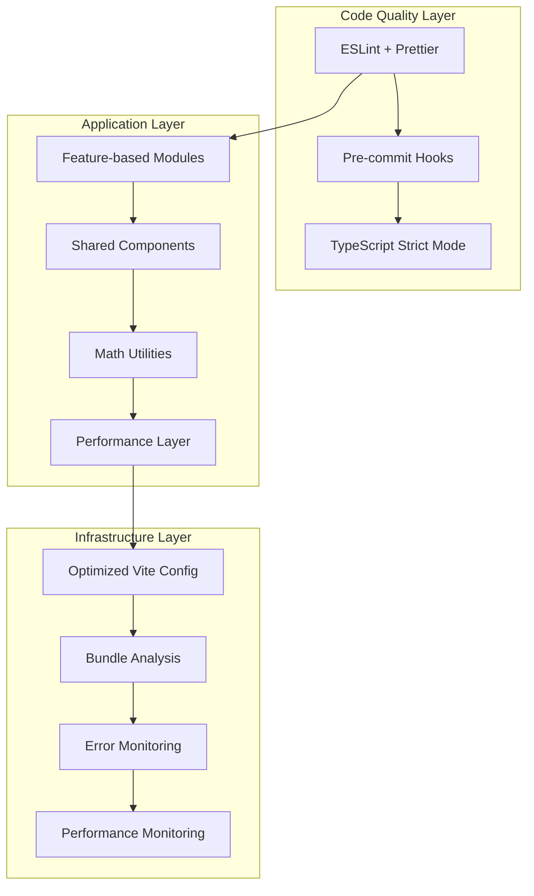

# Design Document

## Overview

This design outlines a systematic approach to improving Math Farm's codebase health through structured refactoring, modernization, and optimization. The cleanup will be implemented in phases to minimize disruption while delivering incremental improvements to code quality, performance, and maintainability.

The current codebase shows good foundational structure with React 18, TypeScript, Vite, and modern math libraries (MathJax 4.0, mathjs 14.6, JSXGraph). However, analysis reveals opportunities for improvement in organization, performance optimization, code quality enforcement, and testing coverage.

## Architecture

### Current State Analysis

**Strengths:**

- Modern tech stack (React 18, TypeScript, Vite 5.4)
- Good separation of concerns with dedicated folders (components, hooks, lib, pages)
- Math libraries are up-to-date (mathjs 14.6, MathJax 4.0-beta)
- Accessibility considerations already in place
- Testing framework established (Vitest, React Testing Library)

**Areas for Improvement:**

- No code quality enforcement (ESLint/Prettier)
- Build configuration not optimized for production
- Components directory has flat structure with many files
- No performance monitoring or error tracking
- Limited test coverage for math operations
- Missing documentation standards

### Target Architecture



## Components and Interfaces

### 1. Code Quality System

**ESLint Configuration:**

```typescript
interface ESLintConfig {
  extends: string[];
  rules: {
    "react-hooks/rules-of-hooks": "error";
    "react-hooks/exhaustive-deps": "warn";
    "@typescript-eslint/strict-boolean-expressions": "error";
    "no-console": "warn";
  };
  overrides: ESLintOverride[];
}
```

**Prettier Configuration:**

```typescript
interface PrettierConfig {
  semi: boolean;
  singleQuote: boolean;
  tabWidth: number;
  trailingComma: "es5" | "all";
  printWidth: number;
}
```

### 2. Feature-based Module Structure

**Target Organization:**

```
client/src/
├── features/
│   ├── math-solver/
│   │   ├── components/
│   │   ├── hooks/
│   │   ├── utils/
│   │   └── __tests__/
│   ├── graphing/
│   └── practice/
├── shared/
│   ├── components/ui/
│   ├── hooks/
│   ├── utils/
│   └── types/
└── lib/
    ├── math/
    ├── performance/
    └── monitoring/
```

### 3. Math Utilities Interface

**Pure Math Functions:**

```typescript
interface MathUtilities {
  // Symbolic math operations
  solve(equation: string, variable: string): MathResult;
  differentiate(expression: string, variable: string): MathResult;
  integrate(expression: string, variable: string): MathResult;

  // Numerical operations
  evaluate(expression: string, scope?: Record<string, number>): number;
  matrix: MatrixOperations;

  // Validation and safety
  validateExpression(expression: string): ValidationResult;
  sanitizeInput(input: string): string;
}

interface MathResult {
  result: string | number;
  steps?: string[];
  error?: string;
  metadata?: Record<string, any>;
}
```

### 4. Performance Monitoring Interface

**Performance Tracker:**

```typescript
interface PerformanceMonitor {
  trackMathOperation(operation: string, duration: number): void;
  trackComponentRender(component: string, renderTime: number): void;
  trackBundleSize(chunks: BundleChunk[]): void;
  getMetrics(): PerformanceMetrics;
}

interface PerformanceMetrics {
  mathOperations: OperationMetric[];
  renderTimes: RenderMetric[];
  bundleAnalysis: BundleAnalysis;
  coreWebVitals: WebVitals;
}
```

## Data Models

### 1. Configuration Models

**Build Configuration:**

```typescript
interface OptimizedViteConfig {
  build: {
    target: "es2020";
    minify: "terser";
    sourcemap: boolean;
    rollupOptions: {
      output: {
        manualChunks: ChunkStrategy;
      };
    };
  };
  optimizeDeps: {
    include: string[];
    exclude: string[];
  };
}
```

### 2. Testing Models

**Test Configuration:**

```typescript
interface TestConfig {
  coverage: {
    threshold: {
      global: {
        branches: 80;
        functions: 80;
        lines: 80;
        statements: 80;
      };
    };
  };
  setupFiles: string[];
  testEnvironment: "jsdom";
}
```

### 3. Error Tracking Models

**Error Context:**

```typescript
interface ErrorContext {
  component: string;
  mathOperation?: string;
  userInput?: string;
  browserInfo: BrowserInfo;
  timestamp: Date;
  stackTrace: string;
}
```

## Error Handling

### 1. Math Operation Error Handling

**Strategy:**

- Wrap all math operations in try-catch blocks
- Provide fallback behaviors for failed computations
- Log detailed error context for debugging
- Display user-friendly error messages

**Implementation:**

```typescript
class MathErrorHandler {
  static handleMathError(error: Error, context: MathContext): MathResult {
    // Log error with context
    this.logError(error, context);

    // Provide fallback result
    return {
      result: "Error in calculation",
      error: this.getUserFriendlyMessage(error),
      metadata: { originalError: error.message },
    };
  }
}
```

### 2. Component Error Boundaries

**Enhanced Error Boundaries:**

- Specific boundaries for math-heavy components
- Graceful degradation for visualization failures
- Error reporting integration
- Recovery mechanisms

### 3. Input Validation

**Security-focused Validation:**

```typescript
class InputValidator {
  static validateMathExpression(input: string): ValidationResult {
    // Check for dangerous patterns
    if (this.containsDangerousPatterns(input)) {
      return { valid: false, error: "Invalid characters detected" };
    }

    // Validate using mathjs parser
    try {
      math.parse(input);
      return { valid: true };
    } catch (error) {
      return { valid: false, error: "Invalid mathematical expression" };
    }
  }
}
```

## Testing Strategy

### 1. Unit Testing

**Math Functions:**

- Test edge cases (NaN, Infinity, division by zero)
- Floating-point precision tests
- Performance benchmarks for complex operations
- Fuzz testing for numerical stability

**React Components:**

- Render tests with various math inputs
- Interaction tests for math tools
- Accessibility tests for math content
- Error state testing

### 2. Integration Testing

**Math Library Integration:**

- Test mathjs operations with various inputs
- MathJax rendering tests
- JSXGraph interaction tests
- Cross-browser compatibility tests

### 3. Performance Testing

**Benchmarking:**

- Math operation execution times
- Component render performance
- Bundle size analysis
- Memory usage monitoring

### 4. Test Organization

**Structure:**

```
__tests__/
├── unit/
│   ├── math/
│   ├── components/
│   └── utils/
├── integration/
│   ├── math-libraries/
│   └── user-flows/
└── performance/
    ├── benchmarks/
    └── load-tests/
```

## Implementation Phases

### Phase 1: Foundation (Code Quality & Structure)

1. Set up ESLint and Prettier
2. Configure pre-commit hooks
3. Reorganize components into feature modules
4. Extract math utilities into pure functions

### Phase 2: Performance & Optimization

1. Optimize Vite configuration
2. Implement code splitting and lazy loading
3. Add performance monitoring
4. Optimize math operations with memoization

### Phase 3: Testing & Reliability

1. Achieve 80% test coverage
2. Add comprehensive math function tests
3. Implement error boundaries and monitoring
4. Set up CI/CD pipeline

### Phase 4: Documentation & Monitoring

1. Generate API documentation
2. Set up Storybook for components
3. Implement error tracking
4. Create developer onboarding guide

## Security Considerations

### Input Sanitization

- Use mathjs safe evaluation mode
- Validate all user inputs before processing
- Implement rate limiting for expensive operations
- Sanitize expressions to prevent code injection

### Dependency Security

- Regular security audits with npm audit
- Automated dependency updates
- Vulnerability scanning in CI/CD
- Minimal privilege principle for math operations

## Performance Targets

### Bundle Size

- Main bundle: < 500KB gzipped
- Math libraries: Lazy loaded when needed
- Component chunks: < 100KB each
- Total initial load: < 1MB

### Runtime Performance

- Math operations: < 100ms for complex calculations
- Component renders: < 16ms (60fps)
- Page load: < 2 seconds (LCP)
- Interactive: < 100ms (FID)

### Memory Usage

- Baseline: < 50MB
- Peak usage: < 200MB
- Memory leaks: Zero tolerance
- Garbage collection: Optimized patterns
