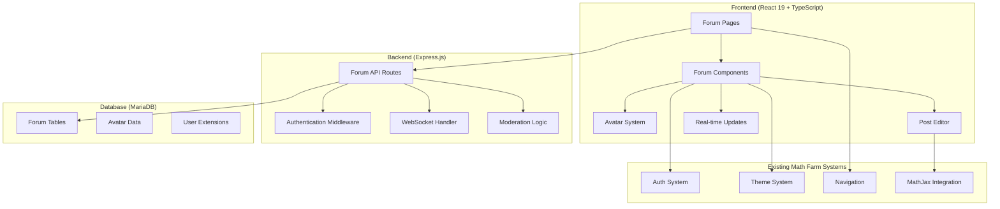

# Design Document

## Overview

The Math Farm Community Forum will be implemented as a new feature module within the existing React application, following the established patterns for features like math-tools and practice. The forum will leverage Math Farm's existing authentication, database, and styling systems while introducing new components for discussion threads, avatar customization, and real-time interactions.

The design emphasizes modularity, performance, and seamless integration with existing Math Farm features, maintaining the purple-themed aesthetic and accessibility standards.

## Architecture

### High-Level Architecture



### Integration Points

The forum will integrate with existing Math Farm systems:

1. **Authentication**: Extends existing JWT/bcrypt system
2. **Navigation**: Adds forum routes to existing Wouter setup
3. **Styling**: Uses established Tailwind classes and shadcn/ui components
4. **Database**: Uses MariaDB tables with proper indexing for forum data storage
5. **Math Rendering**: Leverages existing MathJax configuration

## Components and Interfaces

### Frontend Component Structure

```
client/src/features/forum/
├── components/
│   ├── ForumLayout.tsx           # Main forum wrapper
│   ├── CategoryList.tsx          # Forum categories display
│   ├── ThreadList.tsx            # Thread listing with pagination
│   ├── ThreadView.tsx            # Individual thread display
│   ├── PostComposer.tsx          # Rich text editor with MathJax
│   ├── PostItem.tsx              # Individual post display
│   ├── UserProfile.tsx           # Extended user profile
│   ├── ModerationTools.tsx       # Moderation interface
│   └── avatar/
│       ├── AvatarEditor.tsx      # Avatar customization interface
│       ├── AvatarRenderer.tsx    # Avatar display component
│       ├── ItemInventory.tsx     # Available avatar items
│       └── AvatarPreview.tsx     # Real-time preview
├── hooks/
│   ├── useForum.ts               # Forum data management
│   ├── useRealTimeUpdates.ts     # WebSocket integration
│   ├── useModeration.ts          # Moderation actions
│   └── useAvatar.ts              # Avatar management
├── pages/
│   ├── ForumHome.tsx             # Main forum page
│   ├── CategoryPage.tsx          # Category view
│   ├── ThreadPage.tsx            # Thread detail view
│   └── ProfilePage.tsx           # User profile with avatar
└── lib/
    ├── forumApi.ts               # API client functions
    ├── avatarEngine.ts           # Avatar rendering logic
    ├── mathPostProcessor.ts      # MathJax integration
    └── moderationUtils.ts        # Content filtering
```

### Key Component Interfaces

#### ForumLayout Component

```typescript
interface ForumLayoutProps {
  children: React.ReactNode;
  sidebar?: React.ReactNode;
  breadcrumbs?: BreadcrumbItem[];
}
```

#### PostComposer Component

```typescript
interface PostComposerProps {
  threadId?: string;
  parentPostId?: string;
  onSubmit: (content: PostContent) => Promise<void>;
  initialContent?: string;
  mathJaxEnabled?: boolean;
}

interface PostContent {
  text: string;
  mathExpressions: MathExpression[];
  attachments?: Attachment[];
}
```

#### AvatarEditor Component

```typescript
interface AvatarEditorProps {
  userId: string;
  currentAvatar?: AvatarConfig;
  onSave: (config: AvatarConfig) => Promise<void>;
  availableItems: AvatarItem[];
}

interface AvatarConfig {
  layers: AvatarLayer[];
  backgroundColor: string;
  size: 'small' | 'medium' | 'large';
}
```

### Backend API Structure

```
server/routes/forum/
├── index.ts                      # Route registration
├── categories.ts                 # Category CRUD operations
├── threads.ts                    # Thread management
├── posts.ts                      # Post operations
├── moderation.ts                 # Moderation endpoints
├── avatars.ts                    # Avatar management
└── realtime.ts                   # WebSocket handlers
```

#### API Endpoints

| Method | Endpoint                            | Description              |
| ------ | ----------------------------------- | ------------------------ |
| GET    | `/api/forum/categories`             | List forum categories    |
| GET    | `/api/forum/categories/:id/threads` | Get threads in category  |
| GET    | `/api/forum/threads/:id`            | Get thread with posts    |
| POST   | `/api/forum/threads`                | Create new thread        |
| POST   | `/api/forum/posts`                  | Create new post          |
| PUT    | `/api/forum/posts/:id`              | Edit post                |
| DELETE | `/api/forum/posts/:id`              | Delete post (moderation) |
| GET    | `/api/forum/users/:id/avatar`       | Get user avatar config   |
| PUT    | `/api/forum/users/:id/avatar`       | Update avatar            |
| POST   | `/api/forum/reports`                | Report content           |

## Data Models

### MariaDB Schema

```sql
-- Forum Categories Table
CREATE TABLE forum_categories (
  id INT AUTO_INCREMENT PRIMARY KEY,
  name VARCHAR(255) NOT NULL,
  description TEXT,
  parent_id INT,
  sort_order INT DEFAULT 0,
  created_at TIMESTAMP DEFAULT CURRENT_TIMESTAMP,
  updated_at TIMESTAMP DEFAULT CURRENT_TIMESTAMP ON UPDATE CURRENT_TIMESTAMP,
  INDEX idx_parent_id (parent_id),
  INDEX idx_sort_order (sort_order)
);

-- Forum Threads Table
CREATE TABLE forum_threads (
  id INT AUTO_INCREMENT PRIMARY KEY,
  title VARCHAR(500) NOT NULL,
  category_id INT NOT NULL,
  author_id INT NOT NULL,
  is_pinned BOOLEAN DEFAULT FALSE,
  is_locked BOOLEAN DEFAULT FALSE,
  post_count INT DEFAULT 0,
  last_post_at TIMESTAMP NULL,
  created_at TIMESTAMP DEFAULT CURRENT_TIMESTAMP,
  updated_at TIMESTAMP DEFAULT CURRENT_TIMESTAMP ON UPDATE CURRENT_TIMESTAMP,
  INDEX idx_category_id (category_id),
  INDEX idx_author_id (author_id),
  INDEX idx_last_post_at (last_post_at),
  INDEX idx_created_at (created_at),
  FOREIGN KEY (category_id) REFERENCES forum_categories(id) ON DELETE CASCADE,
  FOREIGN KEY (author_id) REFERENCES users(id) ON DELETE CASCADE
);

-- Forum Posts Table
CREATE TABLE forum_posts (
  id INT AUTO_INCREMENT PRIMARY KEY,
  thread_id INT NOT NULL,
  author_id INT NOT NULL,
  parent_post_id INT NULL,
  content TEXT NOT NULL,
  math_expressions JSON,
  is_edited BOOLEAN DEFAULT FALSE,
  edited_at TIMESTAMP NULL,
  created_at TIMESTAMP DEFAULT CURRENT_TIMESTAMP,
  updated_at TIMESTAMP DEFAULT CURRENT_TIMESTAMP ON UPDATE CURRENT_TIMESTAMP,
  INDEX idx_thread_id (thread_id),
  INDEX idx_author_id (author_id),
  INDEX idx_parent_post_id (parent_post_id),
  INDEX idx_created_at (created_at),
  FOREIGN KEY (thread_id) REFERENCES forum_threads(id) ON DELETE CASCADE,
  FOREIGN KEY (author_id) REFERENCES users(id) ON DELETE CASCADE,
  FOREIGN KEY (parent_post_id) REFERENCES forum_posts(id) ON DELETE CASCADE
);

-- User Avatars Table
CREATE TABLE user_avatars (
  id INT AUTO_INCREMENT PRIMARY KEY,
  user_id INT UNIQUE NOT NULL,
  config JSON NOT NULL,
  unlocked_items JSON DEFAULT ('[]'),
  created_at TIMESTAMP DEFAULT CURRENT_TIMESTAMP,
  updated_at TIMESTAMP DEFAULT CURRENT_TIMESTAMP ON UPDATE CURRENT_TIMESTAMP,
  INDEX idx_user_id (user_id),
  FOREIGN KEY (user_id) REFERENCES users(id) ON DELETE CASCADE
);

-- Forum Reports Table
CREATE TABLE forum_reports (
  id INT AUTO_INCREMENT PRIMARY KEY,
  post_id INT NOT NULL,
  reporter_id INT NOT NULL,
  reason TEXT NOT NULL,
  status ENUM('pending', 'resolved', 'dismissed') DEFAULT 'pending',
  moderator_id INT NULL,
  created_at TIMESTAMP DEFAULT CURRENT_TIMESTAMP,
  resolved_at TIMESTAMP NULL,
  INDEX idx_post_id (post_id),
  INDEX idx_reporter_id (reporter_id),
  INDEX idx_status (status),
  INDEX idx_created_at (created_at),
  FOREIGN KEY (post_id) REFERENCES forum_posts(id) ON DELETE CASCADE,
  FOREIGN KEY (reporter_id) REFERENCES users(id) ON DELETE CASCADE,
  FOREIGN KEY (moderator_id) REFERENCES users(id) ON DELETE SET NULL
);
```

### TypeScript Interfaces

```typescript
interface ForumCategory {
  id: number;
  name: string;
  description?: string;
  parentId?: number;
  sortOrder: number;
  createdAt: Date;
  updatedAt: Date;
}

interface ForumThread {
  id: number;
  title: string;
  categoryId: number;
  authorId: number;
  isPinned: boolean;
  isLocked: boolean;
  postCount: number;
  lastPostAt?: Date;
  createdAt: Date;
  updatedAt: Date;
}

interface ForumPost {
  id: number;
  threadId: number;
  authorId: number;
  parentPostId?: number;
  content: string;
  mathExpressions?: MathExpression[];
  isEdited: boolean;
  editedAt?: Date;
  createdAt: Date;
  updatedAt: Date;
}

interface UserAvatar {
  id: number;
  userId: number;
  config: AvatarConfig;
  unlockedItems: string[];
  createdAt: Date;
  updatedAt: Date;
}

interface ForumReport {
  id: number;
  postId: number;
  reporterId: number;
  reason: string;
  status: 'pending' | 'resolved' | 'dismissed';
  moderatorId?: number;
  createdAt: Date;
  resolvedAt?: Date;
}
```

### Avatar System Data Structure

```typescript
interface AvatarItem {
  id: string;
  name: string;
  category: 'background' | 'body' | 'clothing' | 'accessories' | 'math-tools';
  svgPath: string;
  unlockCondition: {
    type: 'posts' | 'likes' | 'tenure' | 'achievement';
    threshold: number;
  };
  zIndex: number;
}

interface AvatarLayer {
  itemId: string;
  position: { x: number; y: number };
  scale: number;
  rotation: number;
  color?: string;
}
```

## Error Handling

### Frontend Error Boundaries

```typescript
// Extend existing error handling patterns
export class ForumErrorBoundary extends Component<Props, State> {
  // Handle forum-specific errors
  // Integrate with existing ErrorMessage component
}
```

### API Error Responses

```typescript
interface ForumApiError {
  code: 'THREAD_NOT_FOUND' | 'INSUFFICIENT_PERMISSIONS' | 'CONTENT_MODERATED';
  message: string;
  details?: Record<string, any>;
}
```

### Moderation Error Handling

- Content filtering errors fall back to manual review
- Avatar rendering errors show default avatar
- Real-time connection failures gracefully degrade to polling

## Testing Strategy

### Unit Testing

```typescript
// Component tests using existing Vitest setup
describe('PostComposer', () => {
  it('should render MathJax expressions correctly');
  it('should validate post content before submission');
  it('should handle draft saving');
});

describe('AvatarEditor', () => {
  it('should render avatar layers correctly');
  it('should save avatar configuration');
  it('should handle item unlocking');
});
```

### Integration Testing

```typescript
// API endpoint tests
describe('Forum API', () => {
  it('should create threads with proper authentication');
  it('should handle nested post replies');
  it('should enforce moderation permissions');
});
```

### End-to-End Testing

```typescript
// Using existing Cypress setup if available
describe('Forum User Journey', () => {
  it('should allow creating and replying to threads');
  it('should support avatar customization');
  it('should handle real-time updates');
});
```

## Performance Considerations

### Frontend Optimizations

1. **Lazy Loading**: Forum components load only when accessed
2. **Virtual Scrolling**: For long thread lists and post histories
3. **Avatar Caching**: Generated avatars cached in localStorage
4. **MathJax Optimization**: Reuse existing MathJax instance
5. **Image Optimization**: Use existing OptimizedImage component

### Backend Optimizations

1. **Database Indexing**: Proper indexes on frequently queried columns
2. **Pagination**: Limit posts per page (20-50 posts)
3. **Caching**: Cache category structures and user permissions
4. **WebSocket Management**: Efficient connection pooling
5. **Content Sanitization**: Efficient HTML/math expression cleaning

### Real-time Performance

```typescript
// WebSocket message structure
interface ForumWebSocketMessage {
  type: 'new_post' | 'post_edited' | 'thread_locked' | 'user_online';
  threadId?: string;
  data: any;
  timestamp: number;
}
```

## Security Considerations & Audit

### Comprehensive Security Audit

#### 1. Credential and Secret Management

**Database Credentials:**

- MariaDB connection strings MUST be stored in environment variables only
- Database passwords MUST NOT appear in any code files, logs, or configuration files
- Connection pooling credentials MUST be rotated regularly
- Database user accounts MUST follow principle of least privilege

**JWT Security:**

- JWT secrets MUST be stored in environment variables with high entropy (minimum 256 bits)
- JWT tokens MUST have appropriate expiration times (max 24 hours for access tokens)
- Refresh tokens MUST be stored securely and rotated
- JWT secrets MUST NOT be logged or exposed in error messages

**API Keys and External Services:**

- No external API keys required (self-hosted design)
- Any future integrations MUST store keys in environment variables
- API keys MUST NOT be committed to version control
- Development and production environments MUST use separate credentials

#### 2. Password and Hash Security

**Password Handling:**

- User passwords MUST be hashed using bcrypt with minimum cost factor of 12
- Password hashes MUST NEVER be logged or exposed in API responses
- Password reset tokens MUST be cryptographically secure and time-limited
- Failed login attempts MUST be rate-limited and logged

**Hash Table Security:**

- Avatar configurations stored as JSON MUST NOT contain sensitive data
- User session data MUST NOT include password hashes
- Database queries MUST use parameterized statements to prevent injection

#### 3. Data Exposure Prevention

**API Response Security:**

```typescript
// Secure user data serialization
interface PublicUserProfile {
  id: number;
  username: string;
  avatar?: AvatarConfig;
  // NEVER include: password, email, JWT secrets, internal IDs
}

// Sanitize database responses
const sanitizeUserForPublic = (user: User): PublicUserProfile => {
  return {
    id: user.id,
    username: user.username,
    avatar: user.avatar?.config,
    // Explicitly exclude sensitive fields
  };
};
```

**Database Security:**

- Database connections MUST use SSL/TLS encryption
- Database backups MUST be encrypted at rest
- Sensitive fields MUST be excluded from logs and error messages
- Database user permissions MUST be restricted to necessary operations only

#### 4. Content Security

**Input Sanitization:**

```typescript
// Secure content processing
import DOMPurify from 'dompurify';

const sanitizePostContent = (content: string): string => {
  // Remove potentially dangerous HTML/JS
  const clean = DOMPurify.sanitize(content, {
    ALLOWED_TAGS: ['p', 'br', 'strong', 'em', 'code', 'pre'],
    ALLOWED_ATTR: [],
  });

  // Additional validation for math expressions
  return validateMathExpressions(clean);
};
```

**MathJax Security:**

- LaTeX expressions MUST be validated before rendering
- MathJax configuration MUST disable dangerous extensions
- User-generated math content MUST be sandboxed
- XSS prevention through proper escaping of math expressions

#### 5. Authentication and Authorization

**JWT Implementation:**

```typescript
// Secure JWT handling
const generateSecureJWT = (userId: number, role: UserRole): string => {
  const payload = {
    userId,
    role,
    iat: Math.floor(Date.now() / 1000),
    exp: Math.floor(Date.now() / 1000) + 24 * 60 * 60, // 24 hours
  };

  return jwt.sign(payload, process.env.JWT_SECRET!, {
    algorithm: 'HS256',
  });
};

// Secure middleware
const authenticateRequest = (
  req: Request,
  res: Response,
  next: NextFunction
) => {
  const token = req.headers.authorization?.replace('Bearer ', '');

  if (!token) {
    return res.status(401).json({ error: 'No token provided' });
  }

  try {
    const decoded = jwt.verify(token, process.env.JWT_SECRET!) as JWTPayload;
    req.user = decoded;
    next();
  } catch (error) {
    // NEVER log the actual token or secret
    console.error('JWT verification failed');
    return res.status(401).json({ error: 'Invalid token' });
  }
};
```

**Role-Based Access Control:**

- Forum permissions MUST be checked on every request
- Moderator actions MUST be logged with full audit trail
- Admin privileges MUST be restricted to necessary operations
- User roles MUST be validated server-side, never trusted from client

#### 6. Rate Limiting and Abuse Prevention

**API Rate Limiting:**

```typescript
// Secure rate limiting
const rateLimitConfig = {
  windowMs: 15 * 60 * 1000, // 15 minutes
  max: 100, // limit each IP to 100 requests per windowMs
  message: 'Too many requests from this IP',
  standardHeaders: true,
  legacyHeaders: false,
  // Don't expose internal details in error responses
};
```

**Content Abuse Prevention:**

- Post creation MUST be rate-limited per user
- Avatar changes MUST be rate-limited to prevent abuse
- Bulk operations MUST require additional authentication
- Suspicious activity MUST trigger automatic temporary restrictions

#### 7. WebSocket Security

**Real-time Communication Security:**

```typescript
// Secure WebSocket authentication
const authenticateWebSocket = (socket: Socket, next: Function) => {
  const token = socket.handshake.auth.token;

  try {
    const decoded = jwt.verify(token, process.env.JWT_SECRET!);
    socket.userId = decoded.userId;
    next();
  } catch (error) {
    next(new Error('Authentication failed'));
  }
};
```

#### 8. File Upload Security (Avatar Assets)

**Avatar Asset Security:**

- File uploads MUST be restricted to approved image formats only
- File size MUST be limited (max 1MB per asset)
- Uploaded files MUST be scanned for malicious content
- File names MUST be sanitized to prevent directory traversal
- Avatar rendering MUST be sandboxed to prevent code execution

#### 9. Logging and Monitoring Security

**Secure Logging:**

```typescript
// Safe logging practices
const logSecurely = (level: string, message: string, metadata?: any) => {
  const safeMetadata = {
    ...metadata,
    // Remove sensitive fields
    password: undefined,
    token: undefined,
    secret: undefined,
    hash: undefined,
  };

  logger.log(level, message, safeMetadata);
};
```

**Security Monitoring:**

- Failed authentication attempts MUST be monitored
- Unusual posting patterns MUST trigger alerts
- Database access patterns MUST be monitored
- Security events MUST be logged with appropriate detail level

#### 10. Environment and Deployment Security

**Environment Variables:**

```bash
# Required secure environment variables
JWT_SECRET=<high-entropy-secret-256-bits-minimum>
DB_HOST=<database-host>
DB_USER=<limited-privilege-user>
DB_PASSWORD=<strong-database-password>
DB_NAME=<database-name>
BCRYPT_ROUNDS=12
```

**Deployment Security:**

- Production environment MUST use HTTPS only
- Database connections MUST use SSL/TLS
- Environment variables MUST NOT be committed to version control
- Production logs MUST NOT contain sensitive information
- Regular security updates MUST be applied to all dependencies

This comprehensive security audit ensures that no credentials, passwords, API keys, or sensitive data are exposed anywhere in the system while maintaining the self-hosted, secure architecture of Math Farm.

This design ensures the forum integrates seamlessly with Math Farm's existing architecture while providing a robust, performant, and secure community platform.
