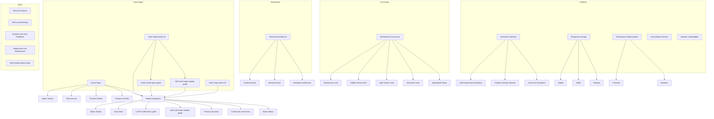

# Product Steering for Math Farm

## Product Vision

Math Farm is a self-hosted, comprehensive mathematics learning platform aimed at making math accessible and engaging for independent learners. It covers topics from elementary arithmetic to advanced calculus, with interactive tools, step-by-step explanations, and specialized guides for LaTeX and MATLAB. The platform emphasizes self-paced learning, gamification, and a clean purple-themed UI, all while being free, open-source, and runnable on a single server without external dependencies.

## Key Priorities

- **User-Centric Design**: Intuitive navigation, responsive layouts, and full accessibility (WCAG 2.2 compliance).
- **Interactivity and Performance**: Client-side tools for instant feedback; optimize for low server load and offline use via PWA.
- **Content Depth**: Modular curriculum with progressive difficulty; easy to extend via data files.
- **Self-Hosting Focus**: No cloud services; prioritize security, simplicity, and zero-cost operation.
- **Roadmap**: MVP: Core pages and tools. Future: Enhanced gamification, user-generated content, local AI hints.

## Target Audience and Use Cases

- **Primary Users**: Adult self-learners seeking independent math study.
- **Secondary Users**: Students (elementary to advanced) for supplemental practice.
- **Use Cases**:
  - Exploring topics with interactive problems and real-time solving.
  - Using tools for quick computations (e.g., graphing, derivatives).
  - Following guides for practical skills like LaTeX or MATLAB simulations.
  - Tracking progress in a personalized, offline-capable dashboard.

## Design Philosophy

- **Accessibility**: TypeScript/HTML5 for maximum browser compatibility, with full WCAG 2.2 compliance.
- **User Experience**: Clean, inviting purple theme with edgy but friendly design, incorporating gamification (badges, streaks).
- **Learning Approach**: Step-by-step solving with client-side hints and adaptive difficulty.
- **Independence**: Self-guided, with optional local peer support via comments.

## Technical Architecture (High-Level)

### Frontend Stack

- **Framework**: React 19 with TypeScript.
- **Build Tool**: Vite 7.1.4 with HMR.
- **Routing**: Wouter (lightweight client-side).
- **State Management**: TanStack Query for server state; React hooks for local.
- **Styling**: Tailwind CSS 4.1.11 with shadcn/ui.
- **Math Rendering**: MathJax 4.0.0 (local, supports full LaTeX/TeX).
- **Icons**: Lucide React; React Icons.
- **Math Libraries**: math.js; Nerdamer; JSXGraph (client-side).

### Backend Stack

- **Server**: Express.js 5.1.0 with TypeScript.
- **Development**: Vite integration for HMR.
- **API**: RESTful, minimal endpoints.
- **Storage**: File-based SQLite.

### Database Architecture

- **ORM**: Drizzle ORM 0.44.5 for SQLite.
- **Provider**: Local SQLite file (e.g., `./database/mathfarm.db`).
- **Schema**: For users, topics, problems, progress.
- **Sessions**: JWT (client-side).

## Color Scheme & Theming

### Light Mode

- Background: hsl(255, 15%, 98%)
- Foreground: hsl(255, 25%, 15%)
- Primary: hsl(262, 65%, 45%)
- Accent: hsl(270, 75%, 65%)
- Card: hsl(255, 25%, 100%)
- Muted: hsl(255, 15%, 95%)

### Dark Mode

- Background: hsl(255, 25%, 8%)
- Foreground: hsl(255, 15%, 92%)
- Primary: hsl(262, 65%, 55%)
- Accent: hsl(270, 75%, 70%)
- Card: hsl(255, 25%, 12%)
- Muted: hsl(255, 25%, 15%)

### Special Effects

- Gradient: Primary to accent (135deg).
- Glass: Backdrop blur.
- Animations: Transitions, hovers, gamification effects.

## Page Structure & Navigation

### Header Navigation

- Logo: Math Farm with radical icon.
- Items: Topics, Tools, LaTeX Guide, MATLAB Guide, Practice, Community, About.
- Controls: Theme toggle, mobile menu, profile/login.

### Main Pages

#### 1. Home (/)

- Hero: Headline, subtitle, CTAs.
- Topics: 9 cards (Algebra to AI Math).
- Tools: Demos of calculators.
- Practice: Examples, gamified challenges.
- Features: Benefits, paths.

#### 2. Topic Pages (/topic/:id)

- Dynamic; redirects for LaTeX/MATLAB.
- Header, samples, problems, suggestions.

#### 3. LaTeX Guide (/latex-guide)

- Sections: Intro, commands, examples.
- Features: Live rendering, copy, progressive examples.

#### 4. MATLAB Guide (/matlab-guide)

- Sections: Syntax, functions, plotting.
- Examples: Highlighted code, simulations.

#### 5. Tools (/tools/:id?)

- Interfaces for calculators; exports.

## Mathematics Curriculum

### Elementary

- Arithmetic, fractions, decimals, percentages.

### Middle School

- Pre-algebra, geometry, integers, ratios.

### High School

- Algebra, geometry, advanced algebra, pre-calculus.

### Advanced

- Calculus, statistics, linear algebra, differential equations.

### Specialized

- Game Design: Vectors, physics.
- LaTeX: Syntax, formatting.
- MATLAB: Matrices, plotting.
- Data Science: Stats, regression.
- AI/ML: Optimization, inference.

## Interactive Features

### Rendering

- MathJax 4.0.0: LaTeX support, responsive.

### Problem Solving

- Steps, input, feedback, tracking.

### Tools

- Solver (Nerdamer/math.js), Graphing (JSXGraph), etc.

## Responsive Design

- Breakpoints: Mobile <640px, Tablet 640-1024px, Desktop >1024px.
- Mobile: Stacked, touch-friendly.
- Desktop: Sidebar, multi-column.

## Performance Optimizations

- Frontend: Splitting, shaking, optimization.
- Backend: Efficient APIs, caching.

## Accessibility Features

- WCAG: Contrast, keyboard, readers.
- Math: Alt text, extensions.

## Browser Compatibility

- Supported: Chrome 120+, Firefox 115+, Safari 17+, Edge 120+.
- Fallbacks: Degradation, loading.

## Security Features

- Auth: bcrypt/JWT.
- Protection: HTTPS, sanitization.

## SEO and Marketing

- On-Page: Meta, schema.
- Strategy: Blog, sharing.

## Analytics and Feedback

- Tools: Self-hosted Matomo.
- Metrics: Engagement.

## Deployment and Maintenance

- Hosting: Node.js/PM2.
- CI/CD: Manual/GitHub Actions.
- Testing: Vitest/Cypress.

## Self-Hosting Setup Guide

- Prerequisites: Node.js v20+.
- Installation: Clone, install, configure, build, run.
- Maintenance: Backups, monitoring.
- Trade-offs: MathJax load times; mitigate with lazy loading.

## User Stories

- As a learner, I want tools for real-time solving.
- As a self-studier, I want guides for advanced topics.
- As a mobile user, I want responsive access.
- As a host, I want easy self-setup.

This steering ensures Kiro aligns with Math Farm's goals.
