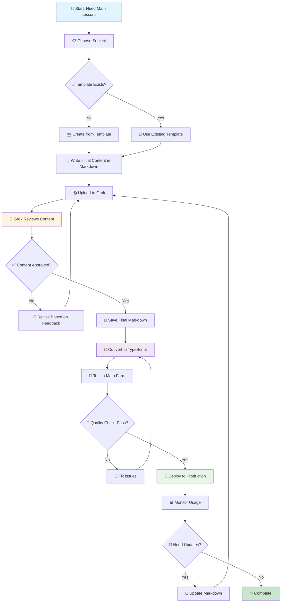
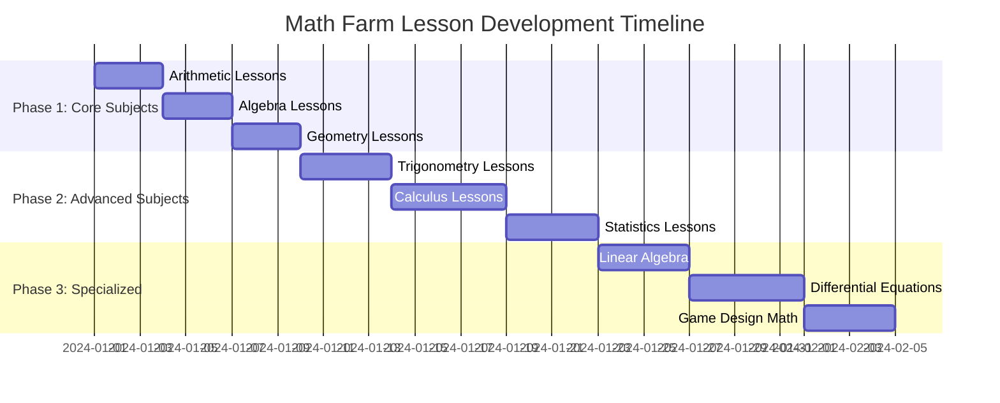
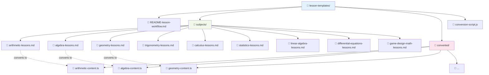
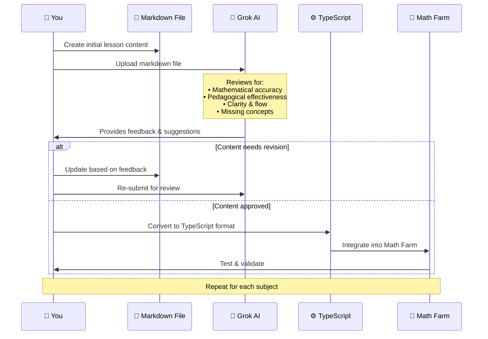
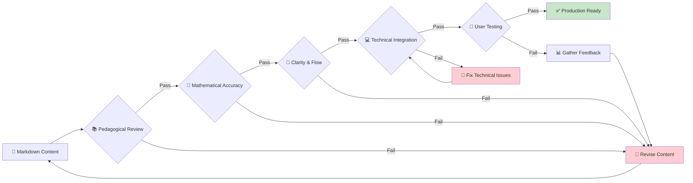
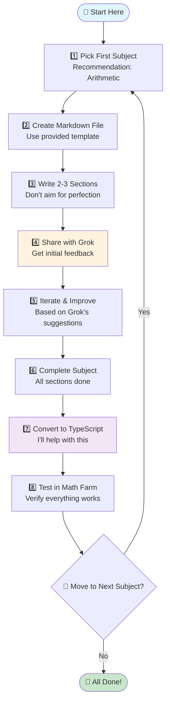

# Math Farm Lesson Content Workflow

## Complete Workflow Diagram

## Subject-by-Subject Process

## File Structure & Organization

## Content Review Process with Grok

## Quality Assurance Checkpoints

## Recommended Action Plan

